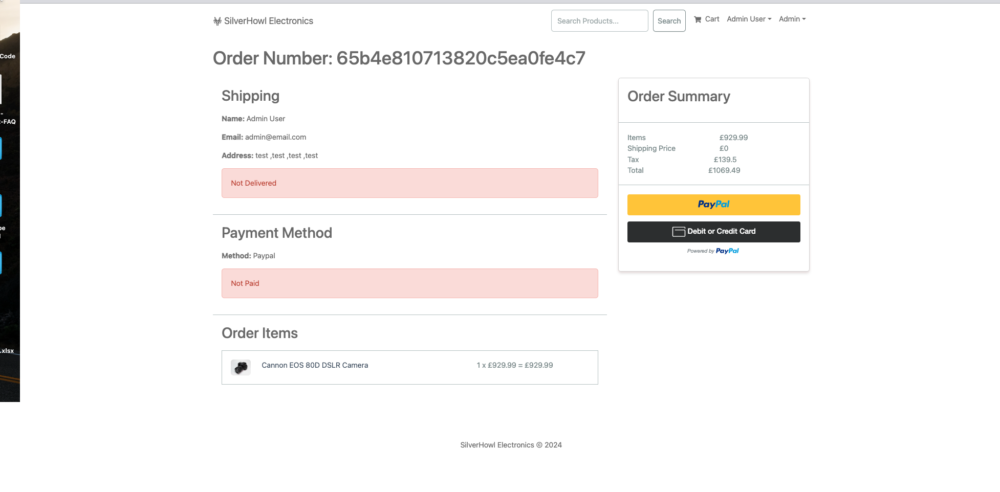

# SilverHowl Electronics - Full Stack MERN E-commerce Store

SilverHowl Electronics is a full-featured MERN (MongoDB, Express, React, Node.js) E-commerce store that offers a comprehensive shopping experience for users.





## Features

- **Full-Featured Shopping Cart:** Add products to your cart and proceed to checkout seamlessly.
- **Product Reviews and Ratings:** Share and read product reviews to make informed decisions.
- **Top Products Carousel:** Discover trending and popular products at a glance.
- **Product Pagination:** Easily navigate through a large number of products with pagination.
- **Product Search Feature:** Quickly find products using the search functionality.
- **User Profile with Orders:** Users can view their profiles and track their order history.
- **Admin Product Management:** Admins can manage the products available in the store.
- **Admin User Management:** Admins have control over user accounts and permissions.
- **Admin Order Details Page:** Detailed view of orders for efficient management.
- **Mark Orders as Delivered:** Admins can update order status to "delivered" for better order tracking.
- **Checkout Process:** Seamless checkout with shipping and payment method options.
- **PayPal / Credit Card Integration:** Secure payment options for users.
- **Database Seeder:** Easily populate the database with sample products and users.

## Technologies Used

- **Frontend:** React
- **Backend:** Node.js, Express.js
- **Database:** MongoDB
- **State Management:** Redux
- **Payment Integration:** PayPal
- **User Authentication:** JSON Web Tokens (JWT)
- **Responsive Design:** Bootstrap
- **Build and Package Management:** npm
- **Development Environment:** Node.js, npm

## Usage

1. Create a MongoDB database and obtain your MongoDB URI from MongoDB Atlas.
2. Create a PayPal account and obtain your Client ID from PayPal Developer.

### Env Variables

Rename the `.env.example` file to `.env` and add the following:

```env
NODE_ENV = development
PORT = 5000
MONGO_URI = your_mongodb_uri
JWT_SECRET = 'abc123'
PAYPAL_CLIENT_ID = your_paypal_client_id
PAGINATION_LIMIT = 8
